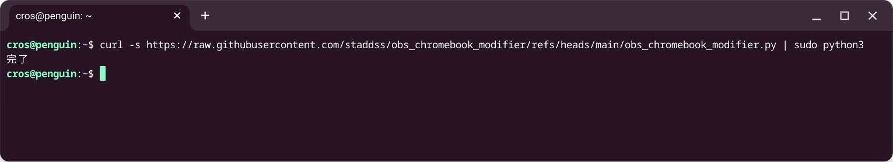

# obs_chromebook_modifier
ChromebookでOBSを起動できるようにするPythonスクリプト

下記コマンドを実行することで/usr/bin/obsを改変する  
`curl -s https://raw.githubusercontent.com/staddss/obs_chromebook_modifier/refs/heads/main/obs_chromebook_modifier.py | sudo python3`
